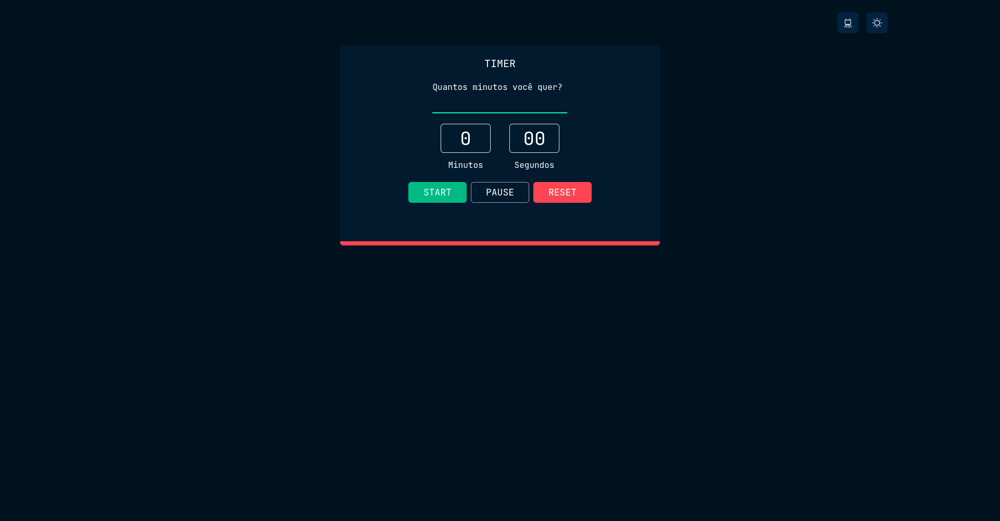

## Hi, I’m Pedro Ygor 

  
  
  

&nbsp;***Talking about Personal Stuffs...***

✔ Pronouns: ***He/His***  
✔ I am currently studying at **Unicesumar**, Systems Analysis and Development,
and also a web development course at **Trybe**  
✔ I'm currently learning **ReactJS** and **NodeJS** 
✔ I'm looking to collaborate on any **Open Source Contribution** 
✔ Ask me about anything, I'll be happy to help 😉 

## <b> Skills</b>

- 📋 Languages:

    
    
    
    
    
    
    
    

- 🎨 Frameworks

   
   
   
   
   
   
   
   
   

- 🔔 Tests:

  
  
  
  

- 💾 Databases:

    
    
    

- 🎛️ Application and Tools:

    
    
    
    
    
    
    
    

 

## :file_folder: Projects

<table>
  <tr>
    <td valign="top">
      <h3 align="left">Todo List</h3>
      

        <a href="https://github.com/pedroygor/desafio-01-ignite-todo-list">Repo</a> -
        <a href="https://pedroygor-todo.netlify.app/">Demo</a>
      

      
    </td>
    <td valign="top">
      <h3 align="left">Wallet</h3>
      

        <a href="https://github.com/pedroygor/trybe-wallet">Repo</a> -
        <a href="https://pedroygor-trybe-wallet.netlify.app/">Demo</a>
      

      
    </td>
    <td valign="top">
      <h3 align="left">Trivia</h3>
      

        <a href="https://pedroygor-trivia.netlify.app/">Demo</a> -
        <a href="https://github.com/pedroygor/trivia-project">Repo</a>
      

      
    </td>
    <td valign="top">
      <h3 align="left">Timer</h3>
      

        <a href="https://github.com/pedroygor/Timer">Repo</a> -
        <a href="https://pedro-ygor-timer.netlify.app/">Demo</a>
      

      
    </td>
  </tr>
</table>
