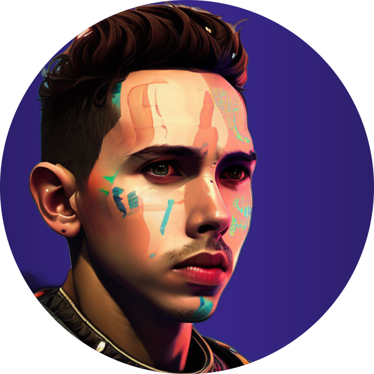

<h1 align="center"> Pedro Ygor - Desenvolvedor FullStack  </h1>

 __:link: Contato:__

  
  
  

___

##  Sobre mim

Sou um desenvolvedor FullStack apaixonado por resolver problemas e criar soluções inovadoras. Estou cursando o curso de Desenvolvimento Web Full Stack na Trybe, onde adquiri habilidades em React.js, Node.js, Express, MongoDB e TypeScript, além de aprender sobre metodologias ágeis e trabalho em equipe. Com minha dedicação e experiência, estou preparado para enfrentar os desafios de projetos de desenvolvimento de software e contribuir para o sucesso da equipe.

## 🎓 Formação Acadêmica

- UniCesumar: CST em Análise e Desenvolvimento de Sistemas, jun 2021 - dez 2023 💻
- Universidade Federal do Ceará: Bacharelado em Ciência da Computação, mar 2015 - dez 2018 🎓
- Universidade Estadual do Ceará: Licenciatura em Matemática, fev 2014 - jan 2015 📈

##  Skills

__Linguagens de programação e Frameworks:__

  
  
  
  
  
  
  
  
  

 

__Banco de dados:__

  
  
  

 

__Ferramentas e Tecnologias:__

  
  
  
  
  
  

 

## :file_folder: Projetos

### :computer: Front End

| Todo List                                                                                                             | Wallet                                                                                                         | Trivia                                                                                                     | Coffee Delivery                                                                                                      |
| --------------------------------------------------------------------------------------------------------------------- | -------------------------------------------------------------------------------------------------------------- | ---------------------------------------------------------------------------------------------------------- | -------------------------------------------------------------------------------------------------------------------- |
| [Repositório](https://github.com/pedroygor/desafio-01-ignite-todo-list) - [Demo](https://pedroygor-todo.netlify.app/) | [Repositório](https://github.com/pedroygor/trybe-wallet) - [Demo](https://pedroygor-trybe-wallet.netlify.app/) | [Repositório](https://github.com/pedroygor/trivia-project) - [Demo](https://pedroygor-trivia.netlify.app/) | [Repositório](https://github.com/pedroygor/coffee-delivery) - [Demo](https://pedroygor-coffee-delivery.netlify.app/) |
|                                                                                               |                                                                                    |                                                                                |                                                                                           |

### :wrench: Back End

| Soccer Manager                                                  |                        Blogs API                         | Car Shop                                             | CRUD de Clientes                                               |
| --------------------------------------------------------------- | :------------------------------------------------------: | ---------------------------------------------------- | -------------------------------------------------------------- |
| [Repositório](https://github.com/pedroygor/trybe-futebol-clube) | [Repositório](https://github.com/pedroygor/api-de-blogs) | [Repositório](https://github.com/pedroygor/car-shop) | [Repositório](https://github.com/pedroygor/backend-sharenergy) |

__🎧 Músicas para animar o meu dia a dia:__

