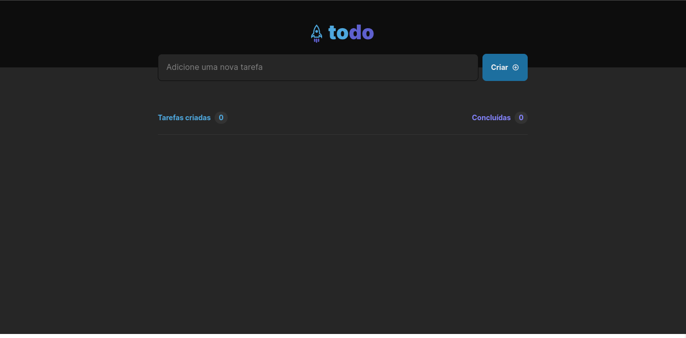
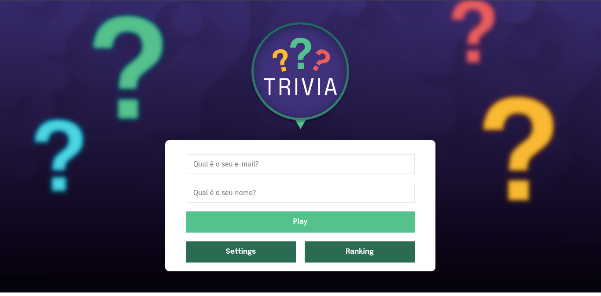
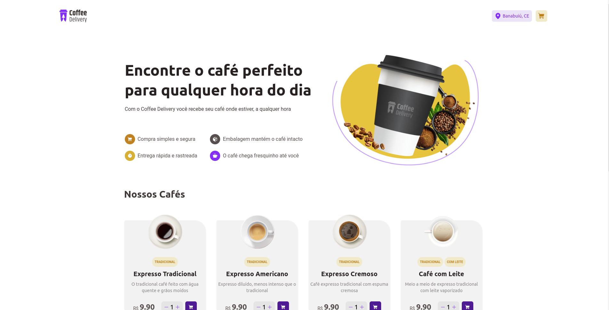

# Pedro Ygor 

"Desenvolvedor Web Full Stack"

##  Sobre mim

Durante meu curso de graduação, participei de projetos de pesquisa e desenvolvimento que me permitiram aprimorar minhas habilidades em programação e algoritmos. Em 2022, comecei minha jornada na Trybe, um curso de Desenvolvimento Web Full Stack, onde aprendi sobre React.js, metodologias ágeis, codificação de front-end, banco de dados e trabalho em equipe, entre outras habilidades importantes para o desenvolvimento de software. Além disso, na Trybe também tive a oportunidade de aprimorar minhas habilidades em back-end, usando Node.js, Express, MongoDB e TypeScript. Com todas essas experiências, estou preparado para contribuir em projetos de desenvolvimento de software.

##  Habilidades

***Front-end:*** Tenho habilidades em React.js, Typescript, Hooks, Context API, Redux, Tailwind, Styled Components, React Hook Form, React Router Dom...  
***Back-end:*** Além de front-end, também sou experiente em desenvolvimento back-end usando Node.js, Express, MongoDB e TypeScript.  
***Trabalho em equipe:*** Durante minha experiência acadêmica e no curso de Desenvolvimento Web Full Stack na Trybe, aprendi a trabalhar de forma eficiente em equipe usando metodologias ágeis.

## :file_folder: Projetos

### :computer: Front End

| Todo List    | Wallet | Trivia | Coffee Delivery |
| ------------- |-------------| ----------| -------- |
| [Repositório](https://github.com/pedroygor/desafio-01-ignite-todo-list) - [Demo](https://pedroygor-todo.netlify.app/)  | [Repositório](https://github.com/pedroygor/trybe-wallet) - [Demo](https://pedroygor-trybe-wallet.netlify.app/) | [Repositório](https://github.com/pedroygor/trivia-project) - [Demo](https://pedroygor-trivia.netlify.app/) | [Repositório](https://github.com/pedroygor/coffee-delivery) - [Demo](https://pedroygor-coffee-delivery.netlify.app/) |
| | | | |

### :wrench: Back End

| Soccer Manager        | Blogs API           | Car Shop  | CRUD de Clientes |
| ------------- |:-------------:| ----- | ---- |
| [Repositório](https://github.com/pedroygor/trybe-futebol-clube)      | [Repositório](https://github.com/pedroygor/api-de-blogs) | [Repositório](https://github.com/pedroygor/car-shop) | [Repositório](https://github.com/pedroygor/backend-sharenergy)|

## :link: Contato

- ***Email:*** pedroygorlo888@gmail.com
- ***LinkedIn:*** [https://www.linkedin.com/in/pedro-ygor/](https://www.linkedin.com/in/pedro-ygor/)
- ***Portfólio***: [https://pedroygor-portfolio.netlify.app/](https://pedroygor-portfolio.netlify.app/)
