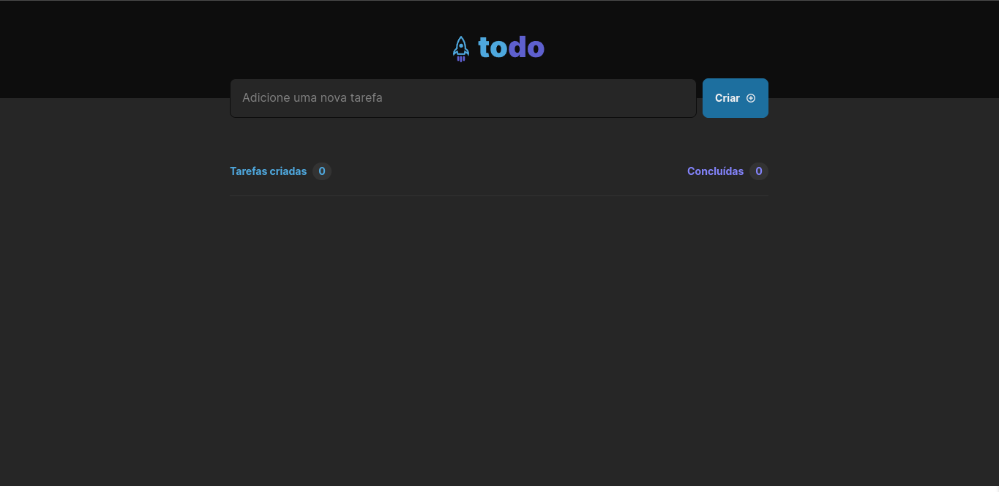
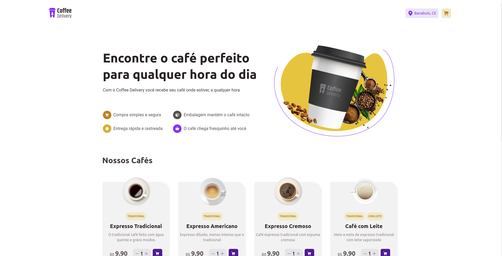

<h1 align="center">Pedro Ygor</h1>
<h4 align="center">☕ Desenvolvedor Java | Adobe Experience Manager (AEM) ☕</h4>

  <a href="https://pedroygor-portfolio.netlify.app/">Portfólio</a> •
  <a href="https://www.linkedin.com/in/pedro-ygor/">LinkedIn</a> •
  <a href="mailto:pedroygorlo888@gmail.com">E-mail</a>

---
 
👋 Olá! Sou o Pedro Ygor, desenvolvedor focado em Java e Adobe Experience Manager (AEM).

Minha carreira foi construída explorando diferentes caminhos até encontrar no desenvolvimento de software a área em que mais me identifico. Ao longo dessa jornada, tive a oportunidade de atuar em diferentes contextos, experiências que contribuíram para desenvolver minha forma de analisar problemas e construir soluções.

Hoje atuo no desenvolvimento de software, principalmente com Java, AEM e tecnologias web. Utilizo este espaço para compartilhar projetos, estudos e ferramentas que desenvolvo durante minha jornada profissional.
 
 

## ⚡️ Habilidades Técnicas
 
**Linguagens**
 

 
**Back-end & Frameworks**
 

📚 **Formação:**

- Curso de Desenvolvimento Web Full Stack na Trybe
- Análise e Desenvolvimento de Sistemas - Unicesumar

 

:file_folder: **Projetos**
> :computer: **Front End**

| Todo List                                                                                                             | Wallet                                                                                                         | Trivia                                                                                                     | Coffee Delivery                                                                                                      |
| --------------------------------------------------------------------------------------------------------------------- | -------------------------------------------------------------------------------------------------------------- | ---------------------------------------------------------------------------------------------------------- | -------------------------------------------------------------------------------------------------------------------- |
| [Repositório](https://github.com/pedroygor/desafio-01-ignite-todo-list) - [Demo](https://pedroygor-todo.netlify.app/) | [Repositório](https://github.com/pedroygor/trybe-wallet) - [Demo](https://pedroygor-trybe-wallet.netlify.app/) | [Repositório](https://github.com/pedroygor/trivia-project) - [Demo](https://pedroygor-trivia.netlify.app/) | [Repositório](https://github.com/pedroygor/coffee-delivery) - [Demo](https://pedroygor-coffee-delivery.netlify.app/) |
|                                                                                               |                                                                                    |                                                                                |                                                                                           |

> :wrench: **Back End**

| Soccer Manager                                                  |                        Blogs API                         | Car Shop                                             | CRUD de Clientes                                               |
| --------------------------------------------------------------- | :------------------------------------------------------: | ---------------------------------------------------- | -------------------------------------------------------------- |
| [Repositório](https://github.com/pedroygor/trybe-futebol-clube) | [Repositório](https://github.com/pedroygor/api-de-blogs) | [Repositório](https://github.com/pedroygor/car-shop) | [Repositório](https://github.com/pedroygor/backend-sharenergy) |

